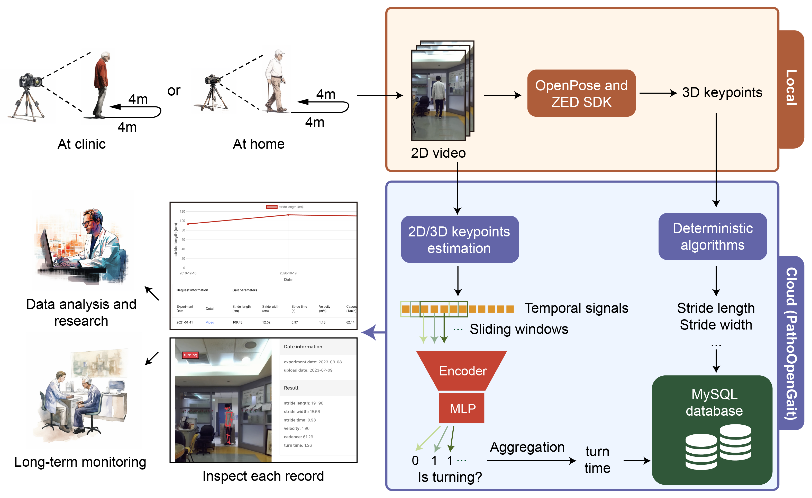
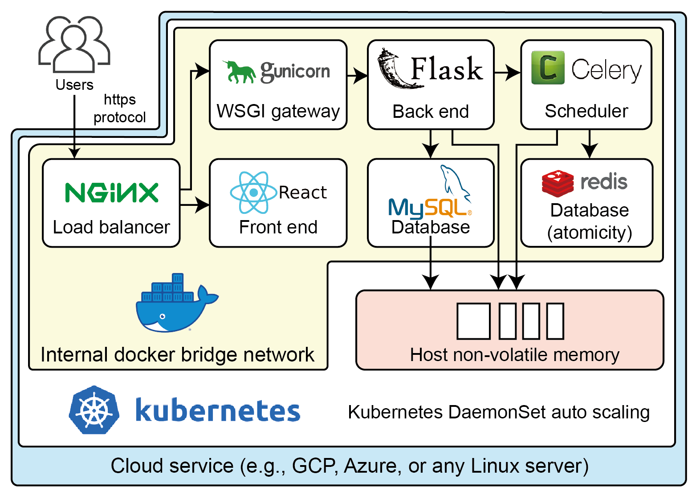

[](https://github.com/Kaminyou/PathoOpenGait/blob/main/LICENSE)

# PathoOpenGait
#### PathoOpenGait: Pathological Gait Analysis With an Open-Source Cloud-Enabled Platform Empowered by Semi-Supervised Learning
For the details, please refer to [our papar](https://ieeexplore.ieee.org/document/10349936/) published in *IEEE journal of biomedical and health informatics*.


## System design (Microservice architecture)


## Get started
1. Please execute `setup.sh` to download pretrained weights for several models.
    ```
    $ ./setup.sh
    ```
2. Please modify `database/sql/create_user.sql` first to create accounts for default admin users.
3. Please create an `.env` file with the following format.
    ```env
    JWT_SECRET_KEY=...
    MYSQL_ROOT_PASSWORD=...
    SQLALCHEMY_DATABASE_URI=mysql+pymysql://root:<MYSQL_ROOT_PASSWORD>@db:3306/ndd
    ```
4. Please make sure the model weights are present in the following path
    ```
    ./backend/algorithms/gait_basic/VideoPose3D/checkpoint/pretrained_h36m_detectron_coco.bin
    ./backend/algorithms/gait_basic/gait_study_semi_turn_time/weights/semi_vanilla_v2/epoch_94.pth
    ```
5. Execute
    ```
    $ docker-compose up --build -d
    ```
## Customized
### Add new algorithms (models) or new data type
1. Please create a folder: `backend/algorithms/<YOUR_ALGORITHM_NAME>`.
2. Your folder should have a `__init__.py` and `main` files.
3. In `main.py`, add `from .._analyzer import Analyzer`.
4. Create a class for your algorithm, which should inherit `Analyzer`.
    ```python
    class CustomizedAnalyzer(Analyzer):
        def __init__(
            self,
            ...
        ):
            ...

        def run(
            self,
            data_root_dir,
            file_id,  # '2021-04-01-1-4'
        ) -> t.List[t.Dict[str, t.Any]]:
            ...
    ```
5. Make sure the return of `run` is in the format of `t.List[t.Dict[str, t.Any]]`.
6. Modify `MAPPING` in `backend/inference/config.py`. For example,
```python
YOUR_MODELS = {
    'your_model_name_1': CustomizedAnalyzer,
    'your_model_name_2': CustomizedAnalyzerV2,
}

MAPPING = {
    'data_type': YOUR_MODELS,
}

```
7. Finish. If you need to modify the input interface or anything else, please directly modify those files.

## Citation
```
@article{ho2024pathological,
  title={Pathological Gait Analysis With an Open-Source Cloud-Enabled Platform Empowered by Semi-Supervised Learning-PathoOpenGait},
  author={Ho, Ming-Yang and Kuo, Ming-Che and Chen, Ciao-Sin and Wu, Ruey-Meei and Chuang, Ching-Chi and Shih, Chi-Sheng and Tseng, Yufeng Jane},
  journal={IEEE journal of biomedical and health informatics},
  volume={28},
  number={2},
  pages={1066--1077},
  year={2024}
}
```